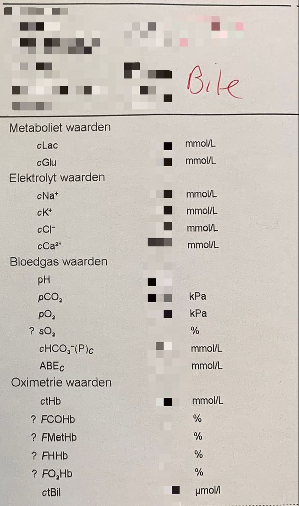

# Transfer document liver perfusion project
### Gilles Lijnzaad, July 22, 2022

This document has all information that I've gathered while working on this project from March-July 2022. I'd be happy to explain anything about it. My email address is g.d.f.lijnzaad@student.rug.nl and phone number is +31615965267.

## Content
  - [Abbreviations](#abbreviations)
  - [Project background](#project-background)
  - [Theoretical background](#theoretical-background)
  - [The system](#the-system)
  - [Code structure](#code-structure)
  - [Installing and running the application](#installing-and-running-the-application)
  - [My user study](#my-user-study)
  - [To-do list](#to-do-list)

## Abbreviations
  - DCD: Donation after Circulatory Death
  - DBD: Donation after Brain Death
  - DHOPE: Dual Hypothermic Oxygenated Perfusion
  - COR: Controlled Oxygenated Rewarming
  - NMP: Normothermic Machine Perfusion
  - OPR: Organ Perfusion Room
  - RBC: Red Blood Cell
  - HBOC: Hemoglobin-Based Oxygen Carrier

## Project background
This project was started in 2019 by the UMCG. I'm not entirely sure, but I think the initiative came from Maarten Nijsten (intensive care surgeon), Vincent de Meijer and Robert Porte (both transplant surgeons). They would like an integrated interface for a process called perfusion, which I will explain in [Theoretical background](#theoretical-background). 

Lisa Deckers was the first one who worked on this. You can find her master's thesis (from December 2019) [here](https://bit.ly/3Cg4GZH). She completed one iteration of the design cycle: she collected requirements, created a low-fidelity prototype and tested it with users. Her project was not specifically focused on the perfusion of livers; she talks about kidneys and lungs as well.

Niklas Martin was the second person to work on this. You can find his master's thesis (from July 2021) [here](https://bit.ly/3maqBM5), and the developer guide he wrote [here](https://fire-seagull-0cc.notion.site/Developer-Guide-dc1babf7ffd54bd88e955b3007aae1b1). Niklas' project does fully focus on livers. He created a fully functional application based on Lisa's prototype. Just like Lisa he also collected user requirements and evaluated the system with users. After his thesis, Niklas also worked for XVIVO for a while, the company that creates the perfusion technology. Niklas' system is an alpha version, since there's still a lot of bugs and it has not been fully tested yet. Before it would be used for an actual perfusion, there should be an experimental perfusion with a pig's liver. But the system currently is not at that stage yet.

My project focused on a specific requirement that Niklas found regarding the AI support system. My project was much smaller than that of Lisa and Niklas. You can read my report [here](https://drive.google.com/file/d/1U5YBDC8sgiKZccs9Zc-H7nrz3AN8MLfQ/view?usp=sharing).

## Theoretical background
As you might know, waiting lists for receiving a donor organ are very long, and there are not many available donor organs. The best donor organs are donations after brain death (DBD). This is because they can keep the patient's heart beating up until the extraction of the organ, meaning that the organ stays oxygenated. However, this doesn't occur that frequently. Donations after circulatory death (DCD) are more common. In those cases, the organ has a limited oxygen supply for a while, which is bad. This is called ischemia. The solution to this is cold machine perfusion, better known as DHOPE (Dual Hypothermic Oxygenated Perfusion). The organ is kept at around 12 degrees Celsius, and flushed with an oxygen solution. This fixes the ischemia-related complications.

However, some livers are high-risk, for example due to the age or health of the donor. Each donor organ has a donor risk index number. Most transplant centers in the Netherlands do not want to risk transplanting a high-risk organ. This organ then goes to the UMCG for warm machine perfusion (at 37 degrees), better known as NMP (Normothermic Machine Perfusion). NMP allows for improving and assessing the viability of an organ. Between 2019 and 2021, they received 54 livers and ended up being able to transplant 34 of them. You can read the paper they wrote about that [here](https://doi.org/10.1111/ajt.17022). 

The two types of professionals involved in perfusions are perfusionists and surgeons, who are quite different in their academical backgrounds and tasks. 
- Perfusionists are PhD students, who are not necessarily medical doctors. Some of the perfusionists I talked to have a background in biomedical engineering/biomedical science, some in medicine. During perfusions, they are the ones that constantly monitor the liver and take action if they need to. There are two main streams of information for them. 
  * The perfusion machine displays a bunch of perfusion parameters, such as the temperature of the fluid flowing through the arterial and portal veins, the pressure of this fluid, etc. 
  * Perfusionists also take a lot of blood and bile samples, which are analyzed by the ABL Blood Gas Analyzer. This results in a whole bunch of parameters, such as pH, glucose and electrolyte levels. Based on this information, perfusionists can take action such as administering medication (e.g. a sodium supplement if sodium levels are low). As mentioned, perfusionists are researchers as well. The perfusion procedure is pretty cutting-edge, and they're continuously trying to improve on it.
- Surgeons are medical doctors (who in this case also do research). They're the ones that are going to perform the transplant itself (of course). They're also involved in preparing the liver for perfusion. They're not present throughout the whole perfusion, because they need to be well-rested for the surgery. One very important thing is that the surgeon is the one who makes the final decision on whether to transplant the liver or not. Perfusionists can give them advice, telling them how well the perfusion went. If it went well, then the advice is pretty clear-cut: let's go. However, if the perfusionist thinks the liver isn't very good, they won't outright tell the surgeon not to go forward with the transplantation, because that has to be the surgeon's call. There is a hierarchy there, with the surgeon at the top as the person with the ultimate responsibility.

Altogether, for high-risk donor livers the process looks like this.

1. **Cardiac arrest** of the donor (unless it's DBD, but those organs are hardly ever high-risk).
2. **No-touch**. After a person has legally passed away, they should not be touched for 5 minutes. I haven't been able to find more information on it, so this is just the gist of it.
3. **Cold flush** of the donor. The time period between the cardiac arrest and cold flush is called warm ischemia time. This is important because as long as the organ is warm (= at body temperature), it is functional and needs oxygen, and if it doesn't get it, complications can occur. There's also the term functional warm ischema time, which is from a critical loss of oxygen (oxygen saturation < 80% or blood pressure < 60 mmHg) to the cold flush.
4. **Extraction** of the liver. After extraction, it is kept at around 4 degrees Celsius (this is static cold storage).
5. **Transport** to the UMCG.
6. **Preparation** of the liver for perfusion by the surgeons on the backtable in the organ perfusion room (OPR). When the organ arrives at the OPR, there's still some fat and organ tissue (e.g. from the pancreas) attached to the liver that needs to be removed.
7. **DHOPE** / Dual Hypothermic Oxygenated Perfusion / cold perfusion. The time period between the cold flush and the start of DHOPE is called cold ischemia time. As said before, DHOPE occurs at around or below 12 degrees Celsius. The liver is flushed with an oxygen solution. Because it's kept cold, not a lot happens. At that temperature, the liver is not metabolic, meaning it won't produce any bile. Perfusionists mostly keep track of the perfusion parameters at this stage. They write these parameters down every 15 minutes on a case report form. DHOPE is performed for 60 minutes.
8. **Fluid switch** (based on the type of fluid they use). If they perform the procedure with an HBOC-based perfusion solution, then this is not necessary. If they use an RBC-based perfusion solution, there is a fluid switch between DHOPE and COR. It takes 15-30 minutes, and requires the surgeons to take the liver out of the machine and the perfusionists to drain the machine and put new fluid in. And then the surgeons put the liver back into the machine.
9. **COR** / Controlled Oxygenated Rewarming. This is a phase between the cold and warm perfusion and it lasts 60 minutes. When the organ starts heating up, it starts to become metabolic, meaning it starts to produce bile. This is where blood and bile samples start to be taken, every 7.5 minutes. The ABL machine analyzes them and prints out the results. Here you can see an example of a printout:

Those pieces of paper are put on the wall of the OPR for everyone to see. This phases is the most chaotic, because the organ is changing a lot with the temperature, and it can be hard to predict the consequences of a manipulation such as medication. 
10. **NMP** / Normothermic Machine Perfusion / warm perfusion. This is when the liver is at body temperature, meaning it is fully functional. During this phase, blood and bile samples are taken every 15 minutes, because the organ is more stable now. NMP lasts 150 minutes, and during that time, the liver kind of has to "prove itself" by producing good blood and bile values. The most important values are the *viability criteria*. Those are 7 parameters that have been found to be the most important in predicting a liver's viability. Through research they have defined safe and unsafe ranges for these parameters: green, orange/yellow and red zones. You can find the values in the [paper](https://doi.org/10.1111/ajt.17022) that I linked above. Not only do they look at these ranges, they also look at livers from the past. They have a huge spreadsheet on the wall of the OPR that has the last values of the viability criteria for each liver that did NMP, and whether or not the liver was transplanted in the end. Those values are also color-coded according to the safe/unsafe ranges. (This spreadsheet is also in the paper.) So to assess viability, perfusionists and surgeons look at that spreadsheet and try to find livers that are a little similar in their values to the current one, and see whether it was transplanted or not. They also look at plots created in R during the perfusion, but for that, they need to manually enter the data from the blood gas printouts into the R script, and they don't always have time for that during the perfusion. Also, the R script was "broken" for a while (whatever that means).
11. **Transplant decision**. After 150 minutes of NMP (270 minutes of total perfusion, so 4.5 hours) the go/no-go is given by the surgeon. If the decision is to not transplant, perfusion is ended right then and there. If the decision is to transplant, perfusion continues until the recipient arrives at the UMCG and is ready for surgery.
12. **Transplant surgery**. Done by the surgeon, of course.
13. **Data entry and logbooks**. Sometimes data entry happens during the perfusion, other times only afterwards. Either way, all data from the perfusion need to be entered into the database. This includes all blood gas printouts and the data they've written down on the case report form. A lot of logbooks need to be created of the perfusion, and need to be uploaded into EPIC (the hospital's electronic medical record system), and sent to Eurotransplant and other authorities. This also includes a lot of manual actions such as calculating time periods (warm/cold ischemia times etc.).

Some random information about the process that I couldn't really include in the story above:
- A perfusionist told me that gaining experience with perfusions is kind of like an S-curve: at first you don't learn a lot, then you suddenly do, and then it stagnates again. When a new perfusionist joins the team, they start out doing more practical stuff (such as writing down the perfusion parameters on the case report form), and when they get more experience they also discuss the course of action with the others. I'd say that there's usually around four perfusionists during a perfusion, and sometimes people join the perfusion later on. (Especially because DHOPE is quite uneventful compared to COR and NMP.)
- The times of the perfusion phases are written on a whiteboard in the OPR. It'll look something like this (I copied this when I observed a perfusion):

Arrival OPR: 12:25

Start backtable: 12:28

Start FLUSH 1: 13:23

Start DHOPE: 14:46

Start FLUSH 2: 15:01

Start COR: ...
- Perfusionists communicate about a perfusion occurring in a WhatsApp group. They'll send messages stating the expected time of arrival and such.

## The system
The idea of the system is to create an integrated interface for all the data that are involved in this process. You can imagine that looking at printouts of data and comparing them to a spreadsheet isn't optimal. The main way in which the system improves on this is by plotting not only the data of the current liver (in blue), but also a regression line of the past livers that *were* transplanted (in green) and those that were *not* transplanted (in red). That makes it easy to compare the trajectory of the current liver with the past good and bad livers. Those plots are based on the ones they currently make in R (though I've never seen those, so I'm not entirely sure). 

The dashboard looks different for each phase: during DHOPE, there's perfusion plots, during COR, there's perfusion plots and some first blood gas plots, and during NMP, there's electrolyte plots and viability criteria plots. At any time, additional plots can be accessed through the navigation bar on the left. The perfusion parameters stay on the top of the dasbhoard at all times. There is also an Action Center on the right, showing the different perfusion phases and medication that was logged. The system also includes an AI system that can recommend medication to supply; those recommendations appear in the Action Center as well. Users can also set reminders (for example, for taking blood & bile samples); those appear in the Action Center too (I think). In the system, you can look back at multiple different organs. E143 is a good one to look at for NMP.

An important functionality of the system is creating PDF reports. This was the solution for the following problem. Surgeons would really like to be able to follow the perfusion from home, to kind of keep up with the liver before they go to transplant it. However, due to privacy and security concerns, it would not currently be possible for surgeons to log into the system directly from home. You can read more about this in Niklas' thesis, pages 44-46; he writes about a possible solution with a VPN, but I think they're generally hesitant about this kind of stuff at the hospital. As a workaround, the system creates a PDF report every 15 minutes that contains a bunch of plots and other data, and sends it to a secure UMCG email address that can be accessed by all surgeons and perfusionists. This functionality was implemented by Niklas while working for XVIVO, so he didn't write about the implementation in his thesis.

An important question is: how would the system actually be used in the OPR? This isn't an easy question, because there's some technical limitations. The idea is that the system will be installed on a brand-new computer that is located in the side room of the OPR, next to the blood gas analyzer. They have a huge monitor on the wall of the OPR that would be great for the interface. I'm not sure how you would get that screen connected to the PC though. And an important question would be where to place the keyboard and mouse for this PC. 

The biggest challenge is getting the data into the system. Ideally there'd be a direct connection between the ABL blood gas analyzer and the system (I don't remember what kind of connection exactly, but definitely a wired connection). This should be possible, because the blood gas analyzer already sends the data to EPIC in real time through an ethernet connection. Exporting the data from EPIC is sadly impossible due to security and privacy settings of that application. However, a direct connection between the ABL blood gas analyzer and a system is a little complicated due to privacy concerns. Maarten has tried to lobby with the people that makes these kinds of decisions at the UMCG, but they're pretty cautious with this kind of stuff. He does think it should be possible, so you'll have to see. There'd be two alternatives if it's not possible in the short term: 
- Manual data entry in the system by perfusionists -- I asked some perfusionists about whether this would be a possibility. One of them thought it definitely would not work, because they wouldn't have enough time to enter all those data manually in real time. Another thought it *would* be possible, because they have a larger team now with more perfusionists, and they currently do it with the R script as well. An easy-to-use data entry page in the system would actually be an improvement to the R script, since that's not that intuitive. They did say that it wouldn't be possible during COR because that phase is so hectic, so that remains a disadvantage, especially because the data are quite important during that stage. Then I guess they'd have to keep the printouts on the wall for that stage, and only start entering the data when they have time.
- Automatic segmentation of the printouts, through a scan or photograph. This is implemented in the system currently, *I think*. Niklas created it when he worked for XVIVO, so this is again something that was not described in his thesis.

Another source of data that should be integrated into the system is the perfusion parameters, so the data that are displayed on the perfusion machine. This is an ever harder issue, because there is literally no way of getting the data out of the machine in real time, only afterwards through USB. A future version of the machine might include this, but that's pretty far into the future I think. Niklas' solution was to have two Raspberry Pi cameras mounted on the perfusion machine that read the displays, and then the images are sent to the system and analyzed automatically. This didn't work reliably, and more importantly, was a hazard: a power supply had to be mounted on the perfusion machine for the cameras, and one time some fluid got into it causing the perfusion machine to short-circuit. I'm not sure if there were big consequences for that perfusion, but it's definitely something that **cannot** happen again. I suppose the only other option to get these perfusion parameters into the system is to have someone enter them manually. I asked how frequently perfusionists would want to check these values, and the answer was basically as frequently as possible. (They write them down on the case report form every 15 minutes but that's only for data collection.) They said it's easy to lose sight of them during COR and NMP when they're looking at the blood gas values, but they stay important the whole time. An additional challenge here is the data entry itself: for the blood gas values, a perfusionist can just take the printout with them to the computer and copy the values, but the perfusion parameters are on the machine itself so that's not portable.

So, lots of challenges there. But this system would help the team tremendously, and I think they would be open to helping solve these practical issues.

## Code structure
The application consists of three elements: the database, the backend and the frontend.

1. MySQL database. The structure of this database is visualized on page 47 of Niklas' thesis. The file is located at `db/data.sql`.
2. Python backend (API). The framework that was used is Flask. The frontend requests data from the API, and then the API sends a JSON response. The files are located at `api/`.
3. JavaScript frontend. The framework that was used is React; more specifically, the Shards React dashboard template. The plots are powered by Google Charts, because Charts.js doesn't support confidence intervals (I think). The files are located at `src/`.

I wish I could tell you more about the code itself, but I didn't get around to working with it.

## Installing and running the application
### Installing
The order doesn't matter all too much here.
1. **The files**

Install [GitHub](https://github.com/git-guides/install-git) and clone the repository. It would of course also be possible to just download the repo as a ZIP, then you don't have to install GitHub.

2. **The database**

Install MySQL. I did this by installing [XAMPP](https://www.apachefriends.org/index.html), which also gets you phpMyAdmin. Now you have to create a user and get the database into MySQL. Make sure XAMPP is running (you could check this by trying to access https://localhost/dashboard), and go to https://localhost/phpmyadmin. 

**Creating a user**: Go to *User accounts* (the fourth item in the top bar) and click *Add user account* (under **New**). Enter a user name, enter % as a host, and enter a password. At **Global privileges**, click *Check all*. 

**Creating the database**: Go back to *Databases* (the first item in the top bar). Under **Create database**, enter the database name `organ` and click *Create*. In the database, click *Import* (the sixth item in the top bar) and upload the data, which are in the file `db/data.sql`. 

To automatically grant the application access to the database, add your user information to `api/db.py` like this:

```python
app.config['MYSQL_DATABASE_USER'] = 'my_user_name'
app.config['MYSQL_DATABASE_PASSWORD'] = 'my_password'
app.config['MYSQL_DATABASE_DB'] = 'organ'
```

3. **Python**

Install the latest version of [Python](https://www.python.org/), or at least > 3.0.

Install all Python dependencies by running the commands below. These commands are relative to the XCEPT folder. This may take a while!

```
cd api
virtualenv venv
pip install -r requirements.txt
```

Run `flask run` to check if it works. You will get some warnings, but as long as you don't get errors it should be okay.

4. **JavaScript**

Install [Node.js](https://nodejs.org/), our JavaScript runtime.

Install [Yarn](https://yarnpkg.com/), the JS package and project manager that we're using. Install Yarn dependencies by running 
```
yarn install
``` 

Then run `yarn start` to check if it works.

### Running
The commands below are relative to the XCEPT folder.
1. Start MySQL (through XAMPP).
2. Start backend:
```
cd api
source venv/bin/activate
flask run
```
3. Start frontend:
```
yarn start
```

It's important to automate this process. Automating for the user should result in a runnable `.exe` file (I don't know how to do that). Automating for the developer is a little easier because it can be whatever you find most useful. I automated the process on my laptop which runs Linux (Ubuntu 20.04 LTS specifically) like this. If you have Windows it might not be extremely useful for you, but who knows. 
1. I wrote an alias to start up XAMPP: `alias xampp="sudo /opt/lampp/lampp start"`. Then all I had to do was run `xampp` and it would start up the services. 
2. I wrote a script that runs the backend in one terminal tab and the frontend in another:
```bash
#!/bin/bash

tab=" --tab"
titles=()
options=()

# first tab: starts up Python back end
titles[1]="Back end"
cmds[1]="cd api; source venv/bin/activate; flask run"

# second tab: starts up JavaScript front end
titles[2]="Front end"
cmds[2]="yarn start"

# open the two tabs in one terminal window
for i in 1 2; do
options+=($tab --title="${titles[i]}" -e "bash -c \"${cmds[i]} ; bash\"" ) 
done
gnome-terminal "${options[@]}"

exit 0
```
3. I automated running this script even further by creating an alias that goes to the XCEPT folder and runs the script: `alias xcept="cd ~/research-project/XVIVO-Interface && ./start-app.sh"`. Then all I had to do was run `xcept` to start the application.

### Docker
Niklas described the possibility of building the application using [Docker](https://www.docker.com), because this would make installation and execution easier, and might even pave the way for mobile devices to connect to the application (I think). However, I wasn't able to get this to work. I followed the steps that Niklas described in his [developer guide](https://fire-seagull-0cc.notion.site/Developer-Guide-dc1babf7ffd54bd88e955b3007aae1b1) but had the issue that Python could not connect to MySQL inside the container. I didn't know enough about this to solve it, unfortunately.

## My user study
My study was about the artificial intelligence support for viability judgment. Most things you need to know about that are in my [report](https://drive.google.com/file/d/1U5YBDC8sgiKZccs9Zc-H7nrz3AN8MLfQ/view?usp=sharing), but I wanted to give a little bit of context here. The reason I chose this topic is because I didn't have time to do a big study, so I needed to choose a rather small topic. Niklas wrote about his AI system in his thesis, and found a new user requirement: an AI page to compare the absolute value judgments to the AI judgment. So I thought, great, I'll make that page and evaluate it with users. However, during my interview with one of the surgeons I discovered that the AI thing wasn't really a request from the team. In fact, they currently really don't have enough data to make an AI work at all. It was mostly thought of by Niklas and Maarten (so I've heard). So that's an important nuance to know. Surgeons and perfusionists really just want to see the system operable as soon as possible, because it would make their jobs a lot easier.

## To-do list
The to-do list will have the following structure. For each to-do, I will indicate the priority value and estimate how much effort it would take to implement the change.

Priority scores:
- 1: cosmetic issue, only fix if it's easy
- 2: minor issue/requirement, low priority ("would be nice")
- 3: major issue/requirement, high priority ("is definitely necessary")
- 4: system cannot be used if this is not fixed

### Bug: plots and tables
*Priority:* 4

*Effort:* Not sure since I don't know where the problem lies exactly.

*Issue:* Some plots and tables don't load. It only shows the loading icon and that's all. Specifically try to switch from the regression line to the individual lines to the boxplot to the table; for some parameters this produces issues.

*Solution:* I asked Niklas about it and he said this: to see what is wrong with the tables you would have to check the Flask prints in the console when you load a table that doesn’t work or add a `console.log` statement in the React file that is displaying the table to see what data is returned from the server.

### Optimization for big monitor
*Priority:* 4

*Effort:* Moderate to high

*Requirement:* Assuming that the interface will be shown on the big monitor in the OPR, it should be optimized for a screen of that size. One specific requirement pertaining to this is showing three plots next to each other. Currently only two plots are shown next to each other, and you have to scroll to see the rest. This goes for the dashboard as well as the extensive pages (that you can access through the navigation bar). Users would like to see three plots next to each other for all three "locations" of a parameter: arterial, portal and bile. (So for example, pH level in arterial vein, in portal vein and in the bile.) That makes it easier to compare them.

*Solution:* Font sizes can be decreased, more information could be shown at once, such as the plots, but also maybe other things. It's important to fully utilize the size of the screen while keeping the information legible.

### Include bile production graph
*Priority:* 3-4

*Effort:* Moderate to high

*Requirement:* The system currently does not include a graph for bile production (amount in mL), which is a parameter that the perfusionists keep track of, and is actually one of the viability criteria. Niklas didn't have time to include it.

*Solution:* Create a plot similar to the bile production plot in the prototype on page 33 of Niklas' thesis. (You can ignore the numbers in the top right of those plots, they were taken out because they're not really useful.)

### Optimization of data entry
*Priority:* 3 (but depends on whether data entry will actually be performed)

*Effort:* High

*Requirement:* Entering the data from a blood gas printout is currently kind of basic and unintuitive. If manual data entry is gonna be performed frequently, it should definitely be optimized to prevent errors as much as possible. If it won't be performed that often, this optimization should still happen, but it won't be as important.

*Solution:* Make the layout of the data entry form similar to what a blood gas printout looks like. Then it'll be a lot easier for perfusionists to compare what they see on the screen to what the see on the paper, allowing them to enter data more quickly and spot errors more easily. I think it would also be good to create a little overview of the data they entered (again, looking similar to the printout) and asking "are you sure you want to save this in the database?", before actually saving it. You could also include "impossible ranges" for each parameter (such as 0), where the system asks "are you sure you mean 0?". That would also decrease errors, though it can also be considered annoying if it doesn't work well.

### Show and edit database
*Priority:* 3

*Effort:*: High

*Requirement:* It should be possible to access and edit the database, in case something went wrong with data recording. Not being able to remove or change incorrect data during a perfusion would be pretty stressful.

Related to this is the ability to export data from the database in a user-friendly way. That's not as urgent as what I described above, but it would be very nice. Currently, data collection for research is very annoying because the data are spread over 5 or 6 different files and programs. And if this system already has all of the data in its database, it would be a no-brainer to let perfusionists export those data.

*Solution:* For every method of entering data (such as blood gas readings, perfusion data, observational notes), there should be an overview of what has already been entered, where the user can edit the data as well.

For the second point, a separate page should be made where users can enter which data they would like to export (which organ, which parameters, etc.) and how (Excel file, .csv, etc.).

### Take out Camera functionality
*Priority:* 3

*Effort:* Minimal

*Issue:* As described before, there were cameras attached to the perfusion machine to read the perfusion parameters, but not anymore. Since the cameras won't be used anymore, it can be taken out of the system, at least visually. It's important to do this because it might cause confusion for users, and it will clear up space in the top bar (where the status of the two cameras is displayed).

*Solution:* Take out the camera parts of the top bar (**Left Camera:** and **Right Camera**), and the **Devices** tab in the navigation bar, and the **Devices** tab from the **Settings** menu.

### Scatterplot on top of boxplots
*Priority:* 2-3

*Effort:* Low to moderate

*Requirement:* The box plots should include a scatter plot of the individual perfusions, because this makes the plots more insightful.

*Solution:* I'm not sure how to do this using Google Charts, I hope it won't be too complicated.

### Action Center bugs
*Priority:* 2-3

*Effort:* Low

*Issue:* There's some bugs in the Action Center. For example, if you add perfusion data through the Action Center, the Back button does not do anything. And if you click Add Data, you see the buttons Edit Reminders, Edit Collections and Edit Supplements but they all refer to the page Add Entry (which is incorrect). This Add Entry page isn't reachable in any other way either, so it seems that it's obsolete, and the buttons should refer to a Settings page. I would play around with the Action Center a bit to find all the bugs, because there might be more.

*Solution:* Probably just some changes in the actions corresponding to the buttons.

### Improve process of customizing dashboard
*Priority:* 2 (pretty major usability issue, but this function probably won't be used that much)

*Effort:* Moderate

*Issue:* Trying to customize what you see on the dashboard is currently kind of a frustrating process. It seems that there is a kind of bug in dragging the parameters to reorder them. There is no icon next to the parameters indicating that you can drag them in the first place. Selecting a measurement from the list is also a little tedious since there's no intuitive order there. And the parameters that you already have are still in the list, when it wouldn't make sense to show one plot twice. (Or maybe it would, if the users would like that.) And when you've selected a new parameter, it doesn't pop out from the list, so you have to read the whole list to find where it is.

*Solution:* Include a drag icon next to the parameters (such as [this](https://fonts.google.com/icons?selected=Material%20Symbols%20Outlined%3Adrag_handle%3AFILL%400%3Bwght%40400%3BGRAD%400%3Bopsz%4048) or [this](https://fonts.google.com/icons?selected=Material%20Symbols%20Outlined%3Adrag_indicator%3AFILL%400%3Bwght%40400%3BGRAD%400%3Bopsz%4048)). Fix the bug so the dragging process is smooth. Create some kind of order in the parameter list that users can choose from (such as **Perfusion parameters**, **Blood gas parameters**). Make the newly added parameter stand out from the rest.

For the parameters that are going to be displayed on the dashboard, what might be better than the top-to-bottom list is to visualize the way that the plots are gonna be laid out on the dashboard in the end. So then you'd put the parameter names in rectangles of the same size as the plots on the dashboard, and users can drag those rectangles around to really get a feel of what the dashboard is going to look like. Maybe they could even drag a rectangle to a little trash bin to remove that parameter from the dashboard. Just an idea, that might be quite challenging to implement.

### Time component
*Priority:* 2

*Effort:* Moderate

*Requirement:* Lisa's system had a time component showing the elapsed minutes since the start of DHOPE. Niklas' system did not have this, and when I asked him about it this is what he said:

"This is very complicated and not very insightful actually. Every procedure is different and because of the different phases and the breaks in between, the elapsed time since the start of DHOPE would not give much information to the perfusionists or surgeons. Moreover, for the blood gas analyzer, the team uses time points (TP). DHOPE consists of TP 0-4 (*15 minutes each = 60, Veerle or Bianca could tell you more), COR TP 4.5-8, and NMP the ones after. The team recently started the new process HOPE-DHOPE-COR-NMP, making the elapsed time but also the TP more difficult to compare. In theory, the idea was to use TP to normalize the duration of each phase and make them comparable to other procedures. For example, blood gas or electrolytes could never be compared across different phases, therefore, the differentiation is very important. I hope this makes sense, ask if you have questions but if you want to go into detail, I’m sure Veerle would love to have an hour-long discussion about this."

So I guess the main question is whether it would be useful to have the time shown in the system. To an outsider it seems like it's pretty important to add, but maybe it actually isn't.

*Solution:* Talk to the users about this.

### Adding new viability criteria
*Priority:* 2

*Effort:* Moderate to high

*Requirement:* There should be a way for users to add new viability criteria to the system. In the interviews, a user told me that they would like to do this because their research might lead to new viability criteria.

*Solution:* In Settings, create a page where users can customize the viability criteria.

### Warnings
*Priority:* 2

*Effort:* High

*Requirement:* Lisa had the idea of adding warnings/alarms to the system for when specific values become too low or too high. Users can customize ranges for the warnings. Niklas didn't have time to implement this.

*Solution:* Read up on how Lisa envisioned it (see page 32 of her thesis), and if necessary, talk to some more users to figure out how they would want it to function and look.

### Comparing blood gas readings
*Priority:* 2

*Effort:* Moderate

*Requirement:* A user told me that they would like to be able to compare blood gas readings from different time stamps, similarly to the way they do it now (which is just holding two pieces of paper next to each other). 

*Solution:* Create a page where users can enter two time stamps and what kind of sample it was, and then the page shows two tables of the blood gas results next to each other.

### Customizable x-axis
*Priority:* 2

*Effort:* Low to moderate

*Requirement:* The plots should have customizable time ranges. This was described in both Lisa's and Niklas' thesis, so I was kind of confused that the system didn't have it. When I asked Niklas about it, he said "Not sure why I removed it. I would guess that it wasn’t really found useful". I think it would be nice to have it in there anyway. 

*Solution:* Maybe there's still some code left that you can reuse, depending on how Niklas removed the feature.

### Supplement > Medication
*Priority:* 2

*Effort:* Very minimal

*Issue:* The system is currently pretty inconsistent in talking about medication. I think perfusionists also switch between the two terms. I think it's best to change everything to medication, but it might be good to check with surgeons and/or perfusionists which term they prefer. The most important thing is just to stay consistent.

*Solution:* Find-and-replace supplement - medication.

### Static organ information
*Priority:* 2

*Effort:* Low to moderate

*Requirement:* A user told me that they would like some "static" information about the organ to be present in the system. They mentioned weight, which is already there (in the top bar of the dashboard). They also mentioned warm ischemia time, functional warm ischemia time, cold ischemia time, backtable time and phase times. The phase times are already logged in the system. The others are not, as far as I know.

*Solution:* There should be a page to enter these time periods. I'm not entirely sure how you would visualize the information. Maybe in the top bar with the weight, but it depends on how often perfusionists and surgeons need to access this information during a perfusion (probably not a lot).

### Consistent y-axes
*Priority:* 2

*Effort:* Moderate

*Requirement:* Lisa found that users would like plots of the same parameter to have the same y-axis bounds. So for example, if you have the three plots for pH level all next to each other (arterial, portal and bile), their y-axis should be the same. This would make it easier to compare the values to each other. 

*Solution:* Find the minimum and maximum of the parameter over the three plots, and take those values as the bounds for all the y-axes.

### PDF reports
*Priority:* 2

*Effort:* Moderate to high

*Requirement:* There are four requests when it comes to the PDF reports:
- Include more blood gas readings. The current PDF has one on page 2, but a user told me they would like more, as a "supplement" to the report. I'd say 3 would be nice, maybe 4.
- Two users told me they would like to see the absolute values of the glucose and the HCO3- in the viability criteria of the PDF report. Right now there's only deltas for those. So four new parameters need to be included: perfusate glucose, biliary glucose, perfusate HCO3- and biliary HCO3-.
- In the Actions table on the third page of the PDF report, one user said they would like to see the real time as well, not just the time point in the perfusion. Because then they can estimate when a next phase is going to start if they're reading the PDF from home and want to join the perfusion later on.
- In the Actions table, one user told me they would like to see not only the medication, but also the context of the medication, i.e., the values of the corresponding parameter: "we see that KCl was needed, but how bad was the K+ value before? And how did it change after the medication?". What I would do: in 1 PDF report you have the intervention "KCl" in the "Intervention" column and "K+: [value]" in a new "Parameter value" column. And then in the next PDF report you just have the new time point (i.e., 15 minutes later than the previous one) and the new K+ value under "Parameter value".

### Creating logbooks
*Priority:* 2

*Effort:* High

*Requirement:* As I described in [Theoretical background](#theoretical-background), perfusionists need to make logbooks after every perfusion which takes a lot of time. It would be very nice if the system could automatically create these logbooks. It would be a lot of work though.

*Solution:* Look into the logbooks, what data they should contain and how it's visualized, and recreate it. Create a page in the system for users to create, view, (edit?) and download the logbooks.

### Phase names in plot
*Priority:* 1

*Effort:* Low to moderate

*Issue:* The plots contain vertical lines for the phase changes, and "[phase name] Start" is shown vertically next to that line. This is not very readable. 

*Solution:* It would be nice to show the phase name horizontally (without the "Start", because that's not very necessary) at the top of the graph.

### Hover-over of plot
*Priority:* 1

*Effort:* Low

*Issue:* When hovering over the lines in a plot, the specific values for the points in the plot are shown. That's very nice, but the labels given to the values aren't understandable.

*Solution:* Change the labels to *t = ..., value: ...*

### Create more order in navigation bar
*Priority:* 1

*Effort:* Low

*Issue:* I personally think there's not enough order in the navigation bar, and I think it would be nice to categorize the options more.

*Solution:* I would order the options like this. The list of subcategories could be made collapsable.
- View Data:
  * Perfusion
  * Blood gas
  * Electrolytes
- Add Data:
  * Perfusion
  * Blood gas
  * Oxygen
  * Phases
  * Bile production
  * Medication
  * Notes
- Reports
- Settings

### Improving icons
*Priority:* 1

*Effort:* Minimal

*Issue:* When it comes to customizing what data is shown, I think the icons could be improved. The box plot button has the icon of a scatterplot, and the table button has the "hamburger menu" icon, which are both confusing to me. This might also come down to personal preference, but it's just important that users understand what would happen if they pressed a button.

*Solution:* Change the boxplot icon to a [candlestick chart icon](https://fonts.google.com/icons?selected=Material%20Symbols%20Outlined%3Acandlestick_chart%3AFILL%400%3Bwght%40400%3BGRAD%400%3Bopsz%4048), and the table icon to the [table chart icon](https://fonts.google.com/icons?selected=Material%20Symbols%20Outlined%3Atable_chart%3AFILL%400%3Bwght%40400%3BGRAD%400%3Bopsz%4048).

### More colors for arterial vs. portal
*Priority:* 0-1

*Effort:* Minimal

*Idea:* This is just an idea of mine, it might not be useful at all but who knows. For the perfusion parameters, you see that the value for the portal vein (VP: *vena portae*) is blue and the value for the hepatic artery (AH: *arteria hepatica*) is red. This color coding is common for veins vs. arteries. It could be nice to extend this color coding, for example so that the text "VP" and "AH" is blue and red respectively. Additionally, I think the Temperature and Oxygen elements should also have the VP/AH above it, so that it's extra clear what the values mean. (Temperature has three values, I'm not entirely sure what the last value is.) 

You could even consider bringing the blue and red to the plots, so that it's easier to see whether the plot is e.g. portal glucose or arterial glucose. At first I thought of making the word "Portal" in "Portal Glucose" blue, but I don't think that would be very readable. Maybe a colored circle in the corner of the "plot rectangle"? It is important though that the blue and red of the veins don't interfere with the blue and red in the plot. Right now, their hues are quite similar, so that might make it confusing: does the red mean bad or does it mean arterial? I don't know, something to think about if there's time.